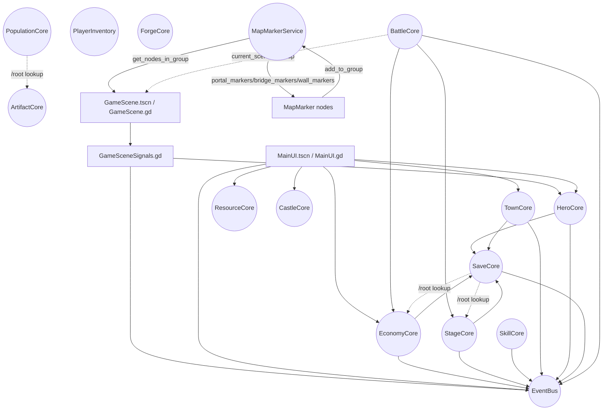

# DEPENDENCIES

## 1) Findings

| Путь | Проблема | Серьёзность | Рекомендация |
|------|----------|-------------|--------------|

| `res://core/save_core.gd` | Оркестрирует save/load через перечисление autoload’ов и `get_node_or_null("/root/<autoload>")` (runtime путь зависит от имени autoload) | 🟡 High | Явный реестр модулей сохранения (ключ -> объект), минимизировать прямые `/root/*` пути |
| `res://scripts/mob/states/MobHealState.gd` | Жёсткий путь к `Wall` через `BattleCore.get_node_or_null("/root/GameScene/Wall")` | 🔴 Critical | Искать `Wall` через group (`wall`) либо получать ссылку через `GameScene`/`BattleCore` API, не через абсолютный путь |
| `res://core/population_core.gd` | Получает бонусы через `/root/ArtifactCore` (жёсткое имя autoload + путь) | 🟡 High | Инъекция зависимости (ArtifactCore как ссылка) или EventBus/сигнал для обновления бонуса |
| UI (`res://scripts/ui/hud/MainUI.gd`, `res://scripts/ui/town/*`, `res://scripts/ui/*`) | Часто использует `get_tree().get_first_node_in_group("main_ui")` для добавления tooltip/popup’ов (зависимость от групп и наличия ноды) | 🟡 High | Централизованный UI Overlay/PopupLayer (одна точка добавления), или автoload `UIRoot` |
| `res://scripts/game/GameScene.gd` | Делает fallback-creation некоторых узлов (например `HeroPivot`, `WaveTimerBar`, ghost building), что скрывает ожидания к структуре дерева | 🟡 High | Стандартизировать структуру сцены (узлы всегда присутствуют в `.tscn`), fallback оставить только как assert/log |
| `res://core/battle_core.gd` | Сильно привязан к сценовому контексту: старт/завершение wave только если `current_scene` в группе `game_scene` | 🟡 High | Явный “battle context” (ссылка на активный `GameScene`/режим) или более явная state-машина игры вместо проверки группы |
| `res://core/battle_core.gd` | Прямые зависимости на другие core: `StageCore.get_current_stage()` + `EconomyCore.add_gold()` внутри `_award_gold_for_wave()` | 🟡 High | Вынести награду за волну в отдельный сервис (например `RewardsService`) или инвертировать зависимость через сигнал `wave_completed` -> слушатель-начислитель |

| Runtime groups (project-wide) | Сильная неявная связность через группы: логика часто ищет узлы через `get_first_node_in_group(...)`/`get_nodes_in_group(...)` вместо явных ссылок | 🟡 High | Документировать обязательные группы и их владельцев, валидировать наличие при старте `GameScene`, по возможности перейти на явные ссылки/DI |

| `res://scripts/map/MapMarkerService.gd` | Зависит от групп marker’ов (`spawn_markers`, `defense_markers`, `portal_markers`, `bridge_markers`, `wall_markers`) и при отсутствии marker’ов отдаёт fallback координаты | 🟡 High | Валидировать наличие ключевых marker’ов при старте `GameScene` (portal/bridge/wall) и логировать ошибку; по возможности хранить “источник истины” в сцене/ресурсе |
| `res://scripts/map/MapMarker.gd` | Назначает группы динамически в `_ready()` по `marker_type` | ⚪ Low | Нормально, но требует дисциплины: marker должен быть реально размещён в сценах, иначе сервис переходит на fallback |

## 2) Graph (Mermaid)

## 3) Groups contract (draft)

Неявные связи через группы (кто выставляет группу, кто её читает). Это один из главных источников “скрытой” связности.

| Group | Set by (кто выставляет) | Used by (кто читает) | Примечания |
|---|---|---|---|
| `game_scene` | `res://scripts/game/GameScene.gd` (`add_to_group`) + `res://scripts/dev/CombatTest.gd` (`add_to_group`) | `res://core/battle_core.gd` (проверяет `current_scene.is_in_group("game_scene")`), `res://scripts/ui/debug/DebugSpawnMenu.gd` (ищет `get_first_node_in_group("game_scene")`) | Если активная сцена “геймплея” не в группе — `BattleCore` не стартует/не завершает волны |
| `main_ui` | `res://scripts/ui/hud/MainUI.gd` (`add_to_group`) | много UI: `BuildingMenu.gd`, `PopulationBar.gd`, `BuildingsTooltip.gd`, `MarketUI.gd`, `MobClickHandler.gd` (ищут/добавляют tooltip/popup под `main_ui`) | Требуется стабильный overlay-layer для popup’ов |
| `hero_bar` | `res://scripts/ui/hud/HeroBar.gd` (`add_to_group`) | `res://scripts/ui/town/TownMenu.gd`, `res://scripts/ui/hud/MainUI.gd` | Используется для скрытия/показа при overlay/town |
| `hero_card` | `res://scripts/ui/overlays/HeroCard.gd` (`add_to_group`) | `res://scripts/ui/town/TownMenu.gd`, `res://scripts/ui/hud/MainUI.gd` | Аналогично `hero_bar` |
| `spell_panel` | `res://scripts/ui/spells/SpellPanel.gd` (`add_to_group`) | `res://scripts/ui/debug/DebugMenu.gd`, `res://scripts/ui/debug/DebugSpawnMenu.gd` | Debug tooling завязан на наличие панели |
| `hero` | `res://scripts/hero/HeroOnField.gd` / `PeasantOnField.gd` / `SmallBones.gd` / `effects/InfernalUnit.gd` (`add_to_group`) | AI/моб-стейты: `HeroAIController.gd`, `MobHealState.gd` (через `get_nodes_in_group("hero")`) | В группу попадают также summons — важно для логики targeting |
| `enemy` | `res://scripts/mob/Mob.gd` (`add_to_group`) | `HeroAIController.gd`, `MobMoveState.gd`, `MobHealState.gd`, `DebugSpawnMenu.gd` | Используется как “все мобы” |
| `wall` | `res://scenes/map/Wall.tscn` (через `groups=["wall"]`) | `MobRunIdleState.gd`, `MobMovingToWallState.gd`, `MobAttackWallState.gd`, `WallHealthUI.gd`, `Mob.gd`, `MapMarkerService.gd` (fallback) | В одном месте задано сценой, не кодом |
| `active_item_popup` | `res://scripts/ui/inventory/ItemTooltip.gd` (`add_to_group`) | `ItemTooltip.gd` (чистит через `get_nodes_in_group`) | Используется как механизм “singleton popup” |
| `map_markers` + `*_markers` | `res://scripts/map/MapMarker.gd` (`add_to_group`, зависит от `marker_type`) | `res://scripts/map/MapMarkerService.gd` (`get_nodes_in_group("spawn_markers"|"defense_markers"|"portal_markers"|...)`) | Если marker’ов нет в сцене — сервис фоллбечит на координаты по умолчанию |
| `corpse` | `res://scripts/effects/Corpse.gd` (`add_to_group`) | — | Пока потребители не найдены в этом проходе |
| `chopped_trees` | `res://scripts/effects/DeforestationEffect.gd`, `res://scripts/map/biomes/BiomeLogic.gd` (`add_to_group`) | presumably biome/stage persistence | Полезно как “маркер состояния” на деревьях |

