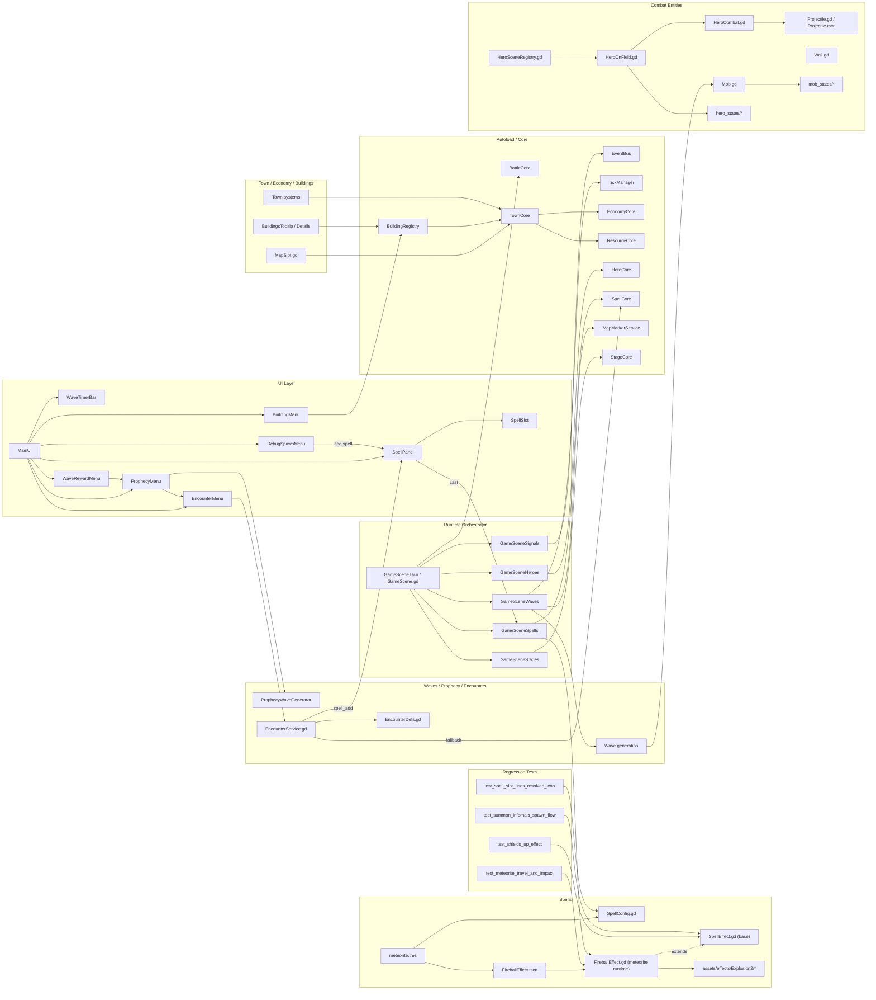

# Project Big Graph (Mermaid)

Last updated: 26.03.2026

This page provides one large Mermaid graph for the current project architecture.

## Usage contract

1. This diagram is an entry map for orientation and navigation.
2. This diagram is not the canonical source of gameplay or architecture behavior.
3. Canonical behavior and file ownership remain in:
   - `docs/PROJECT_NAVIGATOR.md`
   - `docs/ARCHITECTURE.md`
   - focused subsystem docs that actually exist in the repository

## Maintenance rules

1. Update this graph in the same task when runtime topology changes (new/removed modules, autoloads, key scene flows, canonical path moves).
2. Keep only high-value nodes and key edges. Do not expand every helper script into the graph.
3. Prefer labeled edges for non-obvious links (for example `cast`, `fallback`, `spell_add`).
4. Before closing a task that touched this graph, verify Mermaid rendering and cross-check that node paths/names match current code.

